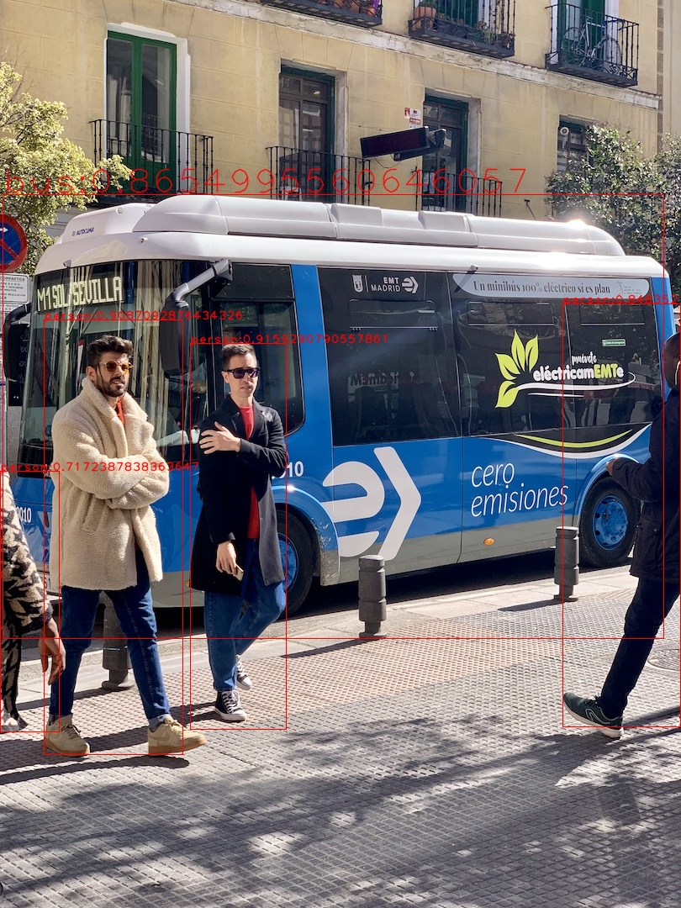

# Yolov7_darknet_opencv_dnn



## Description

Yolov7 use darknet with OpenCV dnn

source code - Pytorch (use to reproduce results):https://github.com/WongKinYiu/yolov7

paper:https://arxiv.org/abs/2207.02696

model:https://github.com/AlexeyAB/darknet/issues/8595

## Getting Started

### Environment
* Ubuntu 20.04
* python 3.8
* OpenCV 4.x up

### Installing

```
git clone https://github.com/aa0308qq/dnn_darknet.git
python3 model.py
```

### Executing program

* It is python library
```
import dnn_darknet
model=dnn_darknet.model.Yolov7(cfg_path,weights_path,class_name_path)
img=cv2.imread(img_path)
class_names,confidences,boxes=model.detect(img)
inference_img=model.draw_boxes(image,class_names,confidences,boxes)
cv2.imshow('result',inference_img)
cv2.waitKey(0)
```

## Reference

Yolov7:https://github.com/WongKinYiu/yolov7
Yolov5:https://github.com/ultralytics/yolov5/tree/master
darknet:https://github.com/AlexeyAB/darknet


## Authors

Contributors names and contact info

[Joe_Wu](https://github.com/aa0308qq)

## License

This project is licensed under the MIT License - see the LICENSE.md file for details
